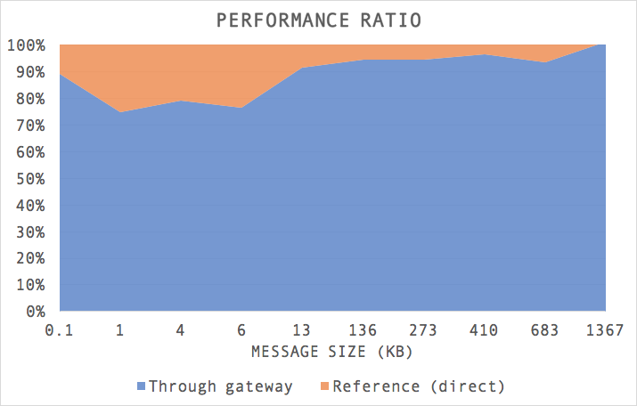

In certain scenarios, exposing a grpc service through a gateway or reverse-proxy is an interesting option.

Examples of such cases are: \* Authentication of incoming calls is sometimes best handled by a dedicated party (in particular if this involves other dependencies, services or SDKs) \* Acting as a reverse proxy, exposing multiple services on the same port \* Hardening security for a gateway is generally easier than hardening the server for instance (in particular if it runs a database and multiple services, or requires certain versions of OS, etc.). It allows keeping security a separate concern, away from the actual data. Gateway and server can also use a different encryption scheme than actual clients (e.g. with mutual TLS).

Below you can find a diagram illustrating an actual setup with a grpc authentication gateway located in front of the server:


In such a configuration, the gateway is in charge of authorizing incoming calls (and rejecting invalid ones), and forwarding all the calls to the server. Typically, this can be achieved by including an `Authorization` header to requests, and checking the header contents in a grpc interceptor. Here is an example implementation of such a authentication token validation interceptor:

```
import io.grpc.Metadata
import io.grpc.Metadata.Key
import io.grpc.ServerCall
import io.grpc.ServerCallHandler
import io.grpc.ServerInterceptor
import io.grpc.Status
import org.slf4j.LoggerFactory

class GrpcAuthorizationInterceptor(tokenValidator: String => Option[String]) extends ServerInterceptor {
  private val logger = LoggerFactory.getLogger(this.getClass)
  val authorizationKey: Key[String] =
    Key.of("authorization", Metadata.ASCII_STRING_MARSHALLER)

  override def interceptCall[ReqT, RespT](call: ServerCall[ReqT, RespT], headers: Metadata, next: ServerCallHandler[ReqT, RespT]): ServerCall.Listener[ReqT] = {
    if (!headers.containsKey(authorizationKey)) {
      logger.warn(s"${call.getMethodDescriptor.getFullMethodName}: missing `authorization` token in headers")
      call.close(Status.UNAUTHENTICATED.withDescription("missing `authorization` token in headers"), new Metadata())
      return new ServerCall.Listener[ReqT] {}
    }
    val authToken = headers.get(authorizationKey)
    tokenValidator(authToken)
      .map(error => {
        logger.warn(s"Got invalid authorization token: $error ({$authToken}), closing call")
        call.close(Status.PERMISSION_DENIED.withDescription("invalid authorization token"), new Metadata())
        new ServerCall.Listener[ReqT] {}
      })
      .getOrElse({
        logger.debug(s"Got valid authentication token ($authToken)")
        next.startCall(call, headers)
      })
  }
}
```

Including such orthogonal aspects in headers (authentication token, or service routing information in the case of a reverse proxy) means that the gateway (or reverse proxy) does not need to decode and re-encode the message, just the headers. This is important to minimize the overhead of this additional layer.

Still missing in this description is the gateway itself. Writing a generic gateway with `grpc-java` is relatively easy thanks to its service introspection APIs. See below the signature of a scala factory function that creates such a gateway:

```
 /** Creates a server service definition for a gateway proxifying all calls to a delegate server
    *  @param protoDescriptor the service descriptor
    *  @param delegateServer a channel to the delegate server
    *  @param callOptions options for calls to the delegate server
    *  @return a server definition for the gateway
    */
  def buildServiceGateway(protoDescriptor: Descriptors.ServiceDescriptor, delegateServer: Channel, callOptions: CallOptions): ServerServiceDefinition
```

Assembling such an authentication gateway can then be done with e.g. such a builder chain:

```
 NettyServerBuilder
      .forAddress(new InetSocketAddress(settings.bindInterface, settings.bindPort))
      .addService(ServerInterceptors.intercept(
          GrpcGateway.buildServiceGateway(SomeService.javaDescriptor, serverChannel, CallOptions.DEFAULT),
          authInterceptor()
        ))
      .directExecutor()
      .build()
```

Where `SomeService.javaDescriptor` allows us to grab the service descriptor we want to build the gateway for (this accessor is generated by the `protoc` compiler - in our case equipped with the [scalapb](https://github.com/scalapb/ScalaPB) plugin).

Implementation of the gateway itself basically introspects all service methods, and for each one generates a `ServerMethodDefinition` which delegates implementation of the method to the corresponding call to the delegate server. We also prevent decoding the incoming stream by specifying a marshaller which simply passes the binary data through.

Below the complete implementation of this gateway in scala:

```
import java.io.InputStream
import com.google.protobuf.Descriptors
import io.grpc.CallOptions
import io.grpc.MethodDescriptor
import io.grpc.MethodDescriptor.Marshaller
import io.grpc.MethodDescriptor.MethodType
import io.grpc.ServerMethodDefinition
import io.grpc.ServerServiceDefinition
import io.grpc.Channel
import io.grpc.stub.ClientCalls
import io.grpc.stub.ServerCalls
import io.grpc.stub.ServerCalls.BidiStreamingMethod
import io.grpc.stub.ServerCalls.ClientStreamingMethod
import io.grpc.stub.ServerCalls.ServerStreamingMethod
import io.grpc.stub.ServerCalls.UnaryMethod
import io.grpc.stub.StreamObserver
import scala.collection.JavaConverters.asScalaBuffer

/** Factory for grpc gateway, proxifying all calls to a delegate server. */
object GrpcGateway {

  /** Creates a server service definition for a gateway proxifying all calls to a delegate server
    *  @param protoDescriptor the service descriptor
    *  @param delegateServer a channel to the delegate server
    *  @param callOptions options for calls to the delegate server
    *  @return a server definition for the gateway
    */
  def buildServiceGateway(protoDescriptor: Descriptors.ServiceDescriptor, delegateServer: Channel, callOptions: CallOptions): ServerServiceDefinition = {
    val serviceName = protoDescriptor.getFullName
    val builder     = ServerServiceDefinition.builder(serviceName)
    asScalaBuffer(protoDescriptor.getMethods).foreach(m => {
      val proxyMethod = MethodDescriptor.create(getMethodType(m), s"$serviceName/${m.getName}", IdentityMarshaller, IdentityMarshaller)
      builder.addMethod(createProxyMethodDefinition(proxyMethod, delegateServer, callOptions))
    })
    builder.build()
  }

  private def getMethodType(method: Descriptors.MethodDescriptor) = {
    val proto = method.toProto
    (proto.getClientStreaming, proto.getServerStreaming) match {
      case (false, false) => MethodType.UNARY
      case (true, false)  => MethodType.CLIENT_STREAMING
      case (false, true)  => MethodType.SERVER_STREAMING
      case (true, true)   => MethodType.BIDI_STREAMING
    }
  }

  private def createProxyMethodDefinition(
      method: MethodDescriptor[InputStream, InputStream],
      delegateServerChannel: Channel,
      callOptions: CallOptions
  ): ServerMethodDefinition[InputStream, InputStream] = {
    val newClientCall = () => delegateServerChannel.newCall(method, callOptions)

    val callHandler = method.getType match {
      case MethodType.UNARY =>
        ServerCalls.asyncUnaryCall(new UnaryMethod[InputStream, InputStream] {
          override def invoke(request: InputStream, responseObserver: StreamObserver[InputStream]): Unit =
            ClientCalls.asyncUnaryCall(newClientCall(), request, responseObserver)
        })
      case MethodType.CLIENT_STREAMING =>
        ServerCalls.asyncClientStreamingCall(new ClientStreamingMethod[InputStream, InputStream] {
          override def invoke(responseObserver: StreamObserver[InputStream]): StreamObserver[InputStream] =
            ClientCalls.asyncClientStreamingCall(newClientCall(), responseObserver)
        })
      case MethodType.SERVER_STREAMING =>
        ServerCalls.asyncServerStreamingCall(new ServerStreamingMethod[InputStream, InputStream] {
          override def invoke(request: InputStream, responseObserver: StreamObserver[InputStream]): Unit =
            ClientCalls.asyncServerStreamingCall(newClientCall(), request, responseObserver)
        })
      case MethodType.BIDI_STREAMING =>
        ServerCalls.asyncBidiStreamingCall(new BidiStreamingMethod[InputStream, InputStream] {
          override def invoke(responseObserver: StreamObserver[InputStream]): StreamObserver[InputStream] =
            ClientCalls.asyncBidiStreamingCall(newClientCall(), responseObserver)
        })
      case MethodType.UNKNOWN => throw new GrpcGatewayException(s"${method.getFullMethodName} has unknown type")
    }
    // create a reverse proxy method which forwards the byte stream to the delegate server
    ServerMethodDefinition.create(method, callHandler)
  }

  private object IdentityMarshaller extends Marshaller[InputStream] {
    def stream(value: InputStream): InputStream = value
    def parse(stream: InputStream): InputStream = stream
  }
}

class GrpcGatewayException(message: String) extends Exception(message)
```

Stress testing access to the service through the gateway compared to direct server access lead to the following latency results:



These numbers only cover the overhead of the gateway itself, not of the network or any TLS decryption/encryption additional costs. It shows that the bigger the message the less significant the overhead becomes. Performance tests also show that the CPU usage is practically 0% and memory consumption is very stable, with only minor garbage collection cycles.
