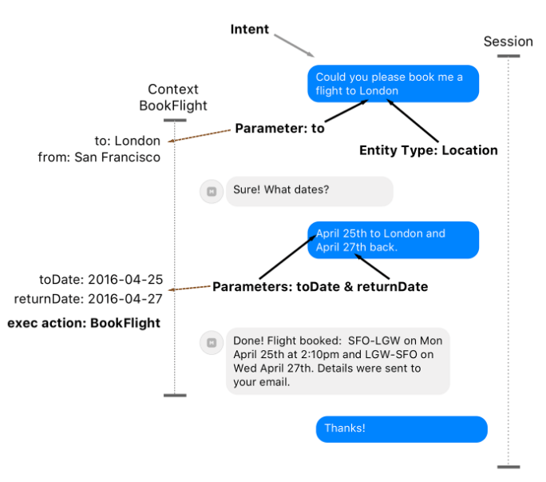
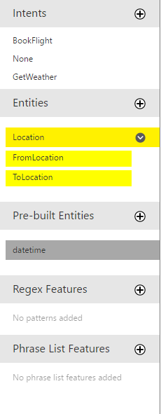
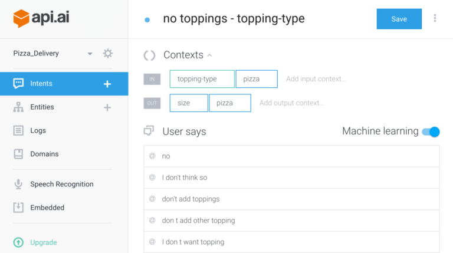
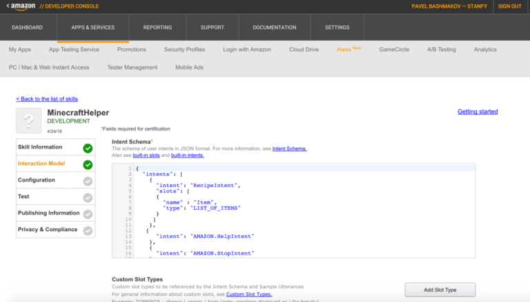

\[caption id="attachment\_364" align="aligncenter" width="235"\] DialogFlow conversational agent app\[/caption\]

\[toc\]

## Introduction

_Conversational agents_ or in short _Bots_ are interfaces emulating a conversation with the user via textual entry or speech, typically to carry out some action. This field has seen some recent interest and there were multiple announcements from major players, probably spurred by the ubiquity of mobile computing and chat-based communication platforms which are becoming ever more prominent (Slack, What's App, etc.) and the improvements in speech recognition.

### Intent

A typical query to such a bot system is _`Could you please book me a flight to London?`_ The first task for the system is to determine the **intent** of the query, i.e. mapping a phrase to a specific action that it can fulfill. Along with the intent, it's necessary to extract the action parameters from the phrase, and if missing, ask for them.

Parameters, also called **entities**, often belong to types which are universal to such applications (e.g. Location, Datetime, number, contact, distance, duration, etc.) and some other more specific entities which have to be defined, typically enumerations (e.g. types of pizza, etc.).

### Interaction

Below a typical interaction with such a system:

\[caption id="attachment\_352" align="aligncenter" width="684"\] Elements of user interaction with a conversational agent\[/caption\]

A **session** represents one conversation from beginning to end. The **context** stores the intermediate states and parameters from previous expressions during the dialogue. Multiple contexts can be present within a session, e.g. to query the user's calendar for suitable flight times or send a personalized email.

The main NLP-related tasks of such systems are:

- **Determining the Intent**: this is a classification problem and is typically done using training-based machine learning methods (e.g. [logistic regression](https://en.wikipedia.org/wiki/Logistic_regression)). The system therefore requires a initial training set.

Even with a small initial set however, results can be good if actions are unambiguous and easy to characterize by some keywords (e.g. in the _book a flight_ example above, the presence of the _`flight`_ keyword has a lot of weight and will make the classification succeed in most cases, especially if the only thing that the system can do with flights is book them). 

Such systems allow progressive refinement of the classification through the administration interface as users start formulating queries in production (also known as _Active Learning_).

- **Parameter extraction**: this is a well described problem in statistical NLP which is known as _Named Entity Recognition_. It is a classification problem which looks at the sequence of tokens in the input and is typically solved using [Conditional Random Fields](https://en.wikipedia.org/wiki/Conditional_random_field)(CRF)

## Systems overview

### [LUIS](https://www.luis.ai/) (Microsoft)

[LUIS](https://www.youtube.com/watch?v=jWeLajon9M8) was introduced during BUILD 2016 together with Microsoft BotFramework and the Skype Developer Platform. It is part of the Microsoft Cognitive Services suite.

Below some examples of configuration for a flight booking service such as the one described in the introduction.

\[caption id="attachment\_353" align="aligncenter" width="230"\] LUIS intents and entities configuration menu\[/caption\]

The dialogue to add a new intent allows defining parameters and entity types for these parameters, as well as their "Required" status. Required parameters trigger an additional question when missing, which can also be configured.

\[caption id="attachment\_354" align="alignnone" width="768"\] Additional question configuration dialogue in LUIS\[/caption\]

Training the system works by typing in a sample query and confirming the intent as well as pointing out entities in the text.

\[caption id="attachment\_355" align="aligncenter" width="588"\] Example of LUIS model training\[/caption\]

The service exposes a REST API which allows building applications with it or connecting it to a Skype Bot. Here an example response for _`book a flight from geneva to london tomorrow`_

```
{
  "query": "book a flight from geneva to london tomorrow ",
  "intents": [
    {
      "intent": "BookFlight",
      "score": 1.0,
      "actions": [
        {
          "triggered": true,
          "name": "BookFlight",
          "parameters": [
            {
              "name": "FromLocation",
              "required": true,
              "value": [
                {
                  "entity": "geneva",
                  "type": "Location::FromLocation",
                  "score": 0.9842492
                }
              ]
            },
            {
              "name": "ToLocation",
              "required": true,
              "value": [
                {
                  "entity": "london",
                  "type": "Location::ToLocation",
                  "score": 0.956707537
                }
              ]
            },
            {
              "name": "Time",
              "required": true,
              "value": [
                {
                  "entity": "tomorrow",
                  "type": "builtin.datetime.date",
                  "resolution": {
                    "date": "2016-06-22"
                  }
                }
              ]
            }
          ]
        }
      ]
    },
    {
      "intent": "None",
      "score": 0.03487882
    },
    {
      "intent": "GetWeather",
      "score": 6.479705E-08,
      "actions": [
        {
          "triggered": false,
          "name": "GetWeather",
          "parameters": [
            {
              "name": "Location",
              "required": true,
              "value": null
            }
          ]
        }
      ]
    }
  ],
  "entities": [
    {
      "entity": "geneva",
      "type": "Location::FromLocation",
      "startIndex": 19,
      "endIndex": 24,
      "score": 0.9842492
    },
    {
      "entity": "london",
      "type": "Location::ToLocation",
      "startIndex": 29,
      "endIndex": 34,
      "score": 0.956707537
    },
    {
      "entity": "tomorrow",
      "type": "builtin.datetime.date",
      "startIndex": 36,
      "endIndex": 43,
      "resolution": {
        "date": "2016-06-22"
      }
    }
  ]
}
```

### Facebook [Wit.ai](http://wit.ai/)

Wit.ai was acquired by Facebook in January 2015. The development environment is quite elaborate and revolves around the idea of building conversations around stories. They have a cool demo with home automation and speech recognition of commands [here](https://labs.wit.ai/demo). See below for somes examples of the bot development experience.

#### Creating a story with an entity

\[WPGP gif\_id="356" width="600"\]

#### Chat UI for conversation testing

\[WPGP gif\_id="358" width="600"\]

### [DialogFlow](https://dialogflow.com/)

DialogFlow (formerly Api.ai) was created by a team who has built a personal assistant app for major mobile platforms with speech and text enabled conversations. The interesting thing is that DialogFlow has built-in domains of knowledge (Intents with Entities and even suggested Replies) on topics like small talk, weather, apps or even wisdom. It means that agents can recognize these intents without any additional training – and can even provide pre-built responses. There are up to 35 different domains with full English support and partial support for the other six languages.

\[caption id="attachment\_365" align="aligncenter" width="768"\] DialogFlow intent configuration screen\[/caption\]

### [Amazon Alexa](https://developer.amazon.com/public/solutions/alexa)

Alexa is the technology powering the [Amazon Echo](https://www.amazon.com/Amazon-Echo-Bluetooth-Speaker-with-WiFi-Alexa/dp/B00X4WHP5E). In that ecosystem, bots are known as _skills_ and new skills can be developed by anyone using the [Alexa Skills Kit](https://developer.amazon.com/public/solutions/alexa/alexa-skills-kit). Skills are subject to an approval process before they can be made available to everyone, but the pay-off can be interesting as the community of Alexa users is growing every day (through Amazon devices for the household).

\[caption id="attachment\_361" align="aligncenter" width="768"\] Screenshot of Alexa skills configuration\[/caption\]

### Cortana, Siri

No need to present those \[icon name="smile-o" class="" unprefixed\_class=""\] Cortana is probably based on similar technology as LUIS to determine intents and parameters. [Cortana is promising](https://www.quora.com/Is-cortana-a-big-failure) in that it benefits from an infrastructure that allows reacting to various events occurring in the cloud, such as varying traffic conditions. In theory this allows notifying the user who's interested in catching a flight that he needs to leave earlier. But unfortunately it has become available only progressively in various regions, with various degrees of support for online services, and typically in Windows 10 it's been suffering from various bugs.

### [Viv](http://viv.ai/) (Siri 2.0)

Viv is Siri's creator [Dag Kittlaus](https://www.crunchbase.com/person/dag-kittlaus) latest startup. It is still under development and little is known about its real capacities ([first demo](https://techcrunch.com/2016/05/09/siri-creator-shows-off-first-public-demo-of-viv-the-intelligent-interface-for-everything/)), but it aims at going beyond this simple scheme of single intent with parameters. For example, _`I want to pick up a Pizza on the way to my girl friend's house and I would like to find a perfect wine to pick up along the way. Also I would like to bring her flowers.`_ Actions behind the intent of this paragraph are manifold and it requires an understanding of who is the girlfriend, where she lives, knowing about pizzerias, flowers and wine shops (and possibly even wine).

Here's an exerpt from the [patent](http://www.google.com/patents/US20140380263):

\[caption id="attachment\_362" align="aligncenter" width="666"\] Excerpt from Viv's patent on "dynamic" conversational agents\[/caption\]

The system forms the intent of the user as seeking a wine recommendation based on a concept object 104 for a menu item, chicken parmesan. Since no single service provider offers such a use case, the system creates a plan based on the user's intent by selecting multiple action objects that may be executed sequentially to provide such a specific recommendation service.

Even though the system has not been intentionally designed to create wine recommendations based on a name of a menu item, it is able to synthesize a way of creating such recommendation based on concept objects and action objects. Although this illustrates an example of a system creating a single plan with a linear sequence that includes three action objects and four concept objects, the system creates multiple plans. Each plan may include any combination of linear sequences, splits, joins and iterative sorting loops, and any number of action objects and concept objects.

Viv is supposedly using _`dynamic programming`_ techniques to create these plans and can connect many different services together in such plans to achieve the intent.

A lengthier description of the novelties in Viv can be found [here](https://www.quora.com/Whats-the-difference-between-Siri-and-Viv).

## Beyond: deep learning

\[WPGP gif\_id="366" width="300"\]

Since 2015 gmail is automatically suggesting replies for emails. This is an amazing application of **deep-learning** technology (detailed [here](https://research.googleblog.com/2015/11/computer-respond-to-this-email.html)).

### Thought vectors

The way it works basically boils down to representing each word and its context with a vector of numbers (300 to 500 numbers). These vectors are called _[Thought Vectors](http://deeplearning4j.org/thoughtvectors)_ as they represent in a very abstract form the utilization of a concept inside of a ensemble of other concepts.

Neural networks can be trained on massive amounts of pairs of email/response _vectorized_ in such a way. To generate an answer to a previously unseen email, the network is fed with the word vectors in sequence, thus applying the training to generate some sentence. An additional layer of some form of semantic distance is applied to the generated replies so that the three most distinct replies are selected for the user interface (otherwise the alternatives would be too similar).

Results are truly amazing, to the point that even creators themselves couldn't initially believe that their approach was working. This concept of thought vectors participated a lot in the spark of renewed excitement around neural networks.

### Application to NLP

Below for instance some graphs of words that were vectorized in their context in various languages, and how these vectors show up when projected on a two dimensional space. Notice how amazingly close the location of similar concepts expressed in various languages! The graph below is even more stunning, where one can see that capitals are located the closest to their country in the projected space, and that country-capital relationships can thus be entirely determined in an _unsupervised_ manner, just with the machine browsing through tons of text!

\[caption id="attachment\_368" align="aligncenter" width="671"\] Thought vectors for common concepts in different languages, as learnt by the machine\[/caption\]

\[caption id="attachment\_369" align="aligncenter" width="768"\] Thought vectors for capitals in relation to the countries, as inferred automatically by the machine from thought vectors\[/caption\]

## Main Source

[https://stanfy.com/blog/advanced-natural-language-processing-tools-for-bot-makers/](https://stanfy.com/blog/advanced-natural-language-processing-tools-for-bot-makers/)
