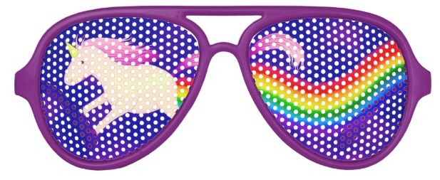

_Optics_: purely functional abstractions to manipulate immutable objects

# Here's a dummy 👶 domain model:

```scala
case class Street(number: Int, name: String); 
case class Address(city: String, street: Street); 
case class Company(name: String, address: Address); 
case class Employee(name: String, company: Company, salary: Int)
```

```plain
    defined class Street
    defined class Address
    defined class Company
    defined class Employee
```

Case classes in Scala are used to define immutable and algebraic data types. They have built-in support for: - pattern matching - comparison by structure - `copy` method which helps for immutable updates

Let's define an employee 👩:

```scala
val employee = Employee("Monica", Company("Bestmile", Address("Lausanne", Street(58, "rhodanie"))), 100)
```

```plain
    employee: Employee = Employee(Monica,Company(Bestmile,Address(Lausanne,Street(58,rhodanie))),100)
```

Now let's say we want to upper case the street name. Here's how we can do it using `copy`:

```scala
employee.copy(
  company = employee.company.copy(
    address = employee.company.address.copy(
      street = employee.company.address.street.copy(
        name = employee.company.address.street.name.capitalize // luckily capitalize exists
      )
    )
  )
)
```

```plain
    res3: Employee = Employee(Monica,Company(Bestmile,Address(Lausanne,Street(58,Rhodanie))),100)
```

Pretty convoluted 🙄. That's when the `Lens` optic becomes useful, as we'll see next.

# `Lens`: magnifying glass 🔍 for immutable data structures

`Lens` is like a zoom for data structures. Let's import the `monocle` library version of `Lens` first (we'll look at `scalaz` later):

```scala
import monocle.Lens
import monocle.macros.GenLens
```

```plain
    import monocle.Lens
    
    import monocle.macros.GenLens
```

Let's define a `lens` on the `company` field of `Employee`:

```scala
val companyLens: Lens[Employee, Company] = GenLens[Employee](_.company)
```

```plain
    companyLens: Lens[Employee, Company] = $sess.cmd5Wrapper$Helper$anon$1@49802b39
```

`GenLens` is a helper scala macro provided by `monocle.macros.GenLens`. A macro is code running at compilation time and emitting code for the actual compilation stage. It emits creation code for our `companyLens` object by introspecting the passed-in selection lambda function.

Here's what we can now do with our lens:

```scala
val foobarCompany = Company("FooBar", Address("Lausanne", Street(58,"rhodanie")))

companyLens.set(foobarCompany)(employee)
```

```plain
    foobarCompany: Company = Company(FooBar,Address(Lausanne,Street(58,rhodanie)))
    res6_1: Employee = Employee(Monica,Company(FooBar,Address(Lausanne,Street(58,rhodanie))),100)
```

Note that `Lens.set` is a curried method, i.e. it defines two parameter lists: 1. value to be set 1. object to set it onto

Therefore, one could also do:

```scala
val foobarCompanySetter = companyLens.set(foobarCompany)
```

```plain
    foobarCompanySetter: Employee => Employee = <function1>
```

And we get a function which can be applied to many employees to set their company to foobar:

```scala
foobarCompanySetter(employee)
// foobarCompanySetter(bob)
// foobarCompanySetter(paul) 
// etc.
```

```plain
    res8: Employee = Employee(Monica,Company(FooBar,Address(Lausanne,Street(58,rhodanie))),100)
```

🤔 Our initial objective actually was to uppercase the street name. Let's see how this can help us get there.

We can define in a similar way lenses for the `address` field of `Company`, for the `street` field of `Address`, and the `name` field of `Street`:

```scala
val addressLens    = GenLens[Company](_.address)
val streetLens     = GenLens[Address](_.street)
val streetNameLens = GenLens[Street](_.name)
```

```plain
    addressLens: Lens[Company, Address] = $sess.cmd9Wrapper$Helper$anon$1@72dfba8e
    streetLens: Lens[Address, Street] = $sess.cmd9Wrapper$Helper$anon$2@2bf5fb3d
    streetNameLens: Lens[Street, String] = $sess.cmd9Wrapper$Helper$anon$3@1eb2bad4
```

We now have the pieces to **compose** a lens to _zoom_ 🔍 into the street name, all the way from the outside of an employee (so to speak 🤭):

```scala
val employeeStreetNameLens = companyLens composeLens addressLens composeLens streetLens composeLens streetNameLens
```

```plain
    employeeStreetNameLens: monocle.PLens[Employee, Employee, String, String] = monocle.PLens$anon$1@fd5814b
```

or expressed in a more compact (but also more cryptic) syntax:

```scala
val employeeStreetNameLens = companyLens ^|-> addressLens ^|-> streetLens ^|-> streetNameLens
```

```plain
    employeeStreetNameLens: monocle.PLens[Employee, Employee, String, String] = monocle.PLens$anon$1@1a18e104
```

We can now apply this to our employee!

```scala
employeeStreetNameLens.modify(_.capitalize)(employee)
```

```plain
    res12: Employee = Employee(Monica,Company(Bestmile,Address(Lausanne,Street(58,Rhodanie))),100)
```

# 🍾🥂

Here's the same example with `scalaz`:

```scala
import scalaz.Lens._
import scalaz.@>
```

```plain
    import scalaz.Lens._
    
    import scalaz.@>
```

```scala
val companyL: Employee @> Company = lensu((employee, company) => employee.copy(company = company), _.company)
val addressL: Company @> Address = lensu((company, address) => company.copy(address = address), _.address)
val streetL: Address @> Street = lensu((address, street) => address.copy(street = street), _.street)
val streetNameL: Street @> String = lensu((street, name) => street.copy(name = name), _.name) 
```

```plain
    companyL: Employee @> Company = scalaz.LensFunctions$anon$5@7e479cf2
    addressL: Company @> Address = scalaz.LensFunctions$anon$5@351133fe
    streetL: Address @> Street = scalaz.LensFunctions$anon$5@4b7b15ab
    streetNameL: Street @> String = scalaz.LensFunctions$anon$5@171e38e
```

Composition is carried out with the 🐟 `>=>` operator (Kleisli composition with `Lens`):

```scala
val employeeStreetNameL = companyL >=> addressL >=> streetL >=> streetNameL
```

```plain
    employeeStreetNameL: scalaz.LensFamily[Employee, Employee, String, String] = scalaz.LensFamilyFunctions$anon$4@255b80bb
```

```scala
employeeStreetNameL.mod(_.capitalize, employee)
```

```plain
    res16: Employee = Employee(Monica,Company(Bestmile,Address(Lausanne,Street(58,Rhodanie))),100)
```

Back to `monocle`: we can even zoom-in further than the street name, directly into the `String` type onto the first char.

Since a `String` can be empty, the first char is optional. We can use `headOption`, a special _optic_ for such cases:

```scala
import monocle.function.Cons.headOption

val deepLens = companyLens ^|-> addressLens ^|-> streetLens ^|-> streetNameLens ^|-? headOption
```

```plain
    import monocle.function.Cons.headOption

    
    deepLens: monocle.POptional[Employee, Employee, Char, Char] = monocle.POptional$anon$1@11cd893d
```

```scala
deepLens.modify(_.toUpper)(employee)
```

```plain
    res18: Employee = Employee(Monica,Company(Bestmile,Address(Lausanne,Street(58,Rhodanie))),100)
```

Note that using `monocle`'s various functions and macros under the `syntax` namespace, one can create lenses directly on the object:

```scala
import monocle.macros.syntax.lens._

employee.lens(_.company.address.street.name).composeOptional(headOption).modify(_.toUpper)
```

```plain
    import monocle.macros.syntax.lens._

    
    res19_1: Employee = Employee(Monica,Company(Bestmile,Address(Lausanne,Street(58,Rhodanie))),100)
```

# Beyond lenses

There are different kinds of optics in `monocle`. They almost all compose with each other. Here's a diagram of all the types, from the most general to the most specific.


# `Iso`: a "mirror" for immutable structures

`Iso` converts elements of type `S` into elements of type `A` when `S` has the same "shape" as `A`. Consider the following case class:

```scala
case class Person(name: String, age: Int)
```

```plain
    defined class Person
```

`Person` is equivalent to a tuple `(String, Int)` and a tuple `(String, Int)` is equivalent to `Person`. We can define "bridges" between types of the same shape that way:

```scala
case class Person(name: String, age: Int)
case class PersonParam(newName: String, newAge: Int)

import monocle.macros.GenIso

// iso to tuple for both types
val personToTuple = GenIso.fields[Person]
val personParamToTuple = GenIso.fields[PersonParam]

// param -> tuple -> person
val paramToPerson =  personParamToTuple composeIso personToTuple.reverse

// applied on Monica
paramToPerson.get(PersonParam("Monica", 21))
// res0: Person = Person(Monica,21)
```

# `Prism` 💎 : pick a color from the 🌈

A `Prism` is an optic used to select part of a `Sum` type (also known as `Coproduct`), typically a `sealed trait`.

It's a type with two parameters `Prism[S, A]`: `S` is the `Sum`, `A` a part of the `Sum`.

Here's an example `Command` sealed trait:

```scala
case class Coordinates(x: Double, y: Double)

sealed trait Command
case class DriveToPickup(target: Coordinates, passengers: Int) extends Command
case class DriveToStation(stationCoordinates: Coordinates) extends Command
case class DriveToDropoff(target: Coordinates, passengers: Int) extends Command
case object EmergencyStop extends Command
case object EmergencyResume extends Command
```

```plain
    defined class Coordinates
    defined trait Command
    defined class DriveToPickup
    defined class DriveToStation
    defined class DriveToDropoff
    defined object EmergencyStop
    defined object EmergencyResume
```

Now let's say we want to define a generic logging function which logs coordinates involved in `Command` instances:

```scala
def logAnyCoordinates(command: Command) = ???
```

That would be the usual implementation:

```scala
def logAnyCoordinatesUsual(command: Command) = {
  val coordinates = 
  command match {
    case DriveToPickup(c, _)  => Some(c)
    case DriveToDropoff(c, _) => Some(c)
    case DriveToStation(c)    => Some(c)
    case _ => None
  }
  println(coordinates.map(c =>  s"x=${c.x}, y=${c.y}").getOrElse(""))
}
```

```plain
    defined function logAnyCoordinatesUsual
```

```scala
logAnyCoordinatesUsual(DriveToDropoff(Coordinates(1.0, 2.0), 2))
logAnyCoordinatesUsual(EmergencyStop)
logAnyCoordinatesUsual(DriveToStation(Coordinates(5.0, 2.0)))
logAnyCoordinatesUsual(EmergencyResume)
logAnyCoordinatesUsual(DriveToDropoff(Coordinates(42, 42), 42))
```

```plain
    x=1.0, y=2.0

    x=5.0, y=2.0

    x=42.0, y=42.0
```

That's ok, but here are some drawbacks:

- This is evolution-fragile: if the `Sum` changes shape, code needs to be touched.
- This sort of selection code is likely to end up duplicated in various places depending on the needs of each method.
- It only describes one thing: extracting the value from the `Sum` type

But most importantly: it's super boring code! 😴 😝 Let's look at another, more generic way to do this using a combination of `Prism` and `Lens`.

First, we need some imports and a helper method (which unfortunately isn't part of monocle)

```scala
import monocle._
import monocle.Optional
import monocle.macros.{GenLens, GenPrism}

implicit class RichOptional[A, B](self: Optional[A, B]) {
  def merge(optional: Optional[A, B]): Optional[A, B] =
    Optional[A, B](a => self.getOption(a).orElse(optional.getOption(a)))(b => a => self.setOption(b)(a).getOrElse(optional.set(b)(a)))
}
```

```plain
    import monocle._
    
    import monocle.Optional
    
    import monocle.macros.{GenLens, GenPrism}

    
    defined class RichOptional
```

Using a combination of `Prism` and `Lens`, we can define an `Optional` which acts as sort of pointer on all coordinates in the `Command` sealed trait:

```scala
val commandCoordinatesOptional = 
GenPrism[Command, DriveToPickup] ^|-> GenLens[DriveToPickup](_.target) merge
GenPrism[Command, DriveToStation] ^|-> GenLens[DriveToStation](_.stationCoordinates) merge
GenPrism[Command, DriveToDropoff] ^|-> GenLens[DriveToDropoff](_.target)
```

```plain
    commandCoordinatesOptional: Optional[Command, Coordinates] = monocle.Optional$anon$6@7276fe7a
```

The combination of `Prism` then "zoom-in" using `^|->` and `Lens` leads to an `Optional`, an optic that represents a value which can be there or not. Then we use horizontal composition between `Optional` instances with `merge`.

We can now rewrite our logging function to take advantage of this:

```scala
def logAnyCoordinatesCool(command: Command) = {
  println(commandCoordinatesOptional.getOption(command).map(c => s"x=${c.x}, y=${c.y}").getOrElse(""))
}
```

```plain
    defined function logAnyCoordinatesCool
```

```scala
logAnyCoordinatesCool(DriveToDropoff(Coordinates(1.0, 2.0), 2))
logAnyCoordinatesCool(EmergencyStop)
logAnyCoordinatesCool(DriveToStation(Coordinates(5.0, 2.0)))
logAnyCoordinatesCool(EmergencyResume)
logAnyCoordinatesCool(DriveToDropoff(Coordinates(42, 42), 42))
```

```plain
    x=1.0, y=2.0

    x=5.0, y=2.0

    x=42.0, y=42.0
```

Even more 🆒 is the ability to update the coordinates for all! We can now define:

```scala
def offsetByOne(coordinates: Coordinates) = coordinates.copy(x = coordinates.x + 1, y = coordinates.y + 1)

def offsetCoordinatesByOne(command: Command) = commandCoordinatesOptional.modify(offsetByOne)(command)
```

```plain
    defined function offsetByOne
    defined function offsetCoordinatesByOne
```

```scala
offsetCoordinatesByOne(DriveToDropoff(Coordinates(1.0, 2.0), 2))
offsetCoordinatesByOne(EmergencyStop)
offsetCoordinatesByOne(DriveToStation(Coordinates(5.0, 2.0)))
offsetCoordinatesByOne(EmergencyResume)
offsetCoordinatesByOne(DriveToDropoff(Coordinates(42, 42), 42))
```

```plain
    res8_0: Command = DriveToDropoff(Coordinates(2.0,3.0),2)
    res8_1: Command = EmergencyStop
    res8_2: Command = DriveToStation(Coordinates(6.0,3.0))
    res8_3: Command = EmergencyResume
    res8_4: Command = DriveToDropoff(Coordinates(43.0,43.0),42)
```

# `Traversal` ➿: many eyes see it all 🕷️

`Traversal` can focus into all elements inside of a container (e.g. `List`, `Vector`, `Option`). In more generic terms, it allows to focus from a type `S` into _0 to n_ values of type `A`.

For instance, let's say each vehicle keeps a journal 📒 of commands:

```scala
case class Vehicle(name: String, id: Int)
case class VehicleCommandsJournal(vehicle: Vehicle, commands: List[Command])
```

```plain
    defined class Vehicle
    defined class VehicleCommandsJournal
```

Here's a journal with some commands:

```scala
val journal = VehicleCommandsJournal(
  Vehicle("Navia1", 1),
  List(
    DriveToPickup(Coordinates(1.0, 2.0), 2),
    DriveToDropoff(Coordinates(5.0, 3.0), 2),
    DriveToStation(Coordinates(5.0, 2.0)),
    EmergencyStop
  ))
```

```plain
    journal: VehicleCommandsJournal = VehicleCommandsJournal(Vehicle(Navia1,1),List(DriveToPickup(Coordinates(1.0,2.0),2), DriveToDropoff(Coordinates(5.0,3.0),2), DriveToStation(Coordinates(5.0,2.0)), EmergencyStop))
```

Let's see if we can carry out our coordinates offset stunt. First, we need some more imports:

```scala
import monocle.Traversal
import scalaz.std.list.listInstance // we need scalaz Traverse type class instance for List in scope
```

```plain
    import monocle.Traversal
    import scalaz.std.list.listInstance // we need scalaz Traverse type class instance for List in scope
```

We can now define a traversal for commands in the journal:

```scala
val commandsLens = GenLens[VehicleCommandsJournal](_.commands) // first the lens
val commandsCoordinatesTraversal = commandsLens ^|->> fromTraverse[List, Command, Command] // compose with the commands traversal
```

```plain
    commandsLens: monocle.package.Lens[VehicleCommandsJournal, List[Command]] = $sess.cmd12Wrapper$Helper$anon$1@446a2d03
    commandsCoordinatesTraversal: PTraversal[VehicleCommandsJournal, VehicleCommandsJournal, Command, Command] = monocle.PTraversal$anon$2@7d066293
```

We can use this `Traversal` instance to define an offset function which works on `VehicleCommandsJournal`:

```scala
def offsetAllCoordinatesByOne(journal: VehicleCommandsJournal) = 
  commandsCoordinatesTraversal.modify(offsetCoordinatesByOne)(journal)
```

```plain
    defined function offsetAllCoordinatesByOne
```

And now let's apply it to our small `journal`:

```scala
offsetAllCoordinatesByOne(journal)
```

```plain
    res14: VehicleCommandsJournal = VehicleCommandsJournal(Vehicle(Navia1,1),List(DriveToPickup(Coordinates(2.0,3.0),2), DriveToDropoff(Coordinates(6.0,4.0),2), DriveToStation(Coordinates(6.0,3.0)), EmergencyStop))
```

# 🍻🍻🍻

# Typeclasses

We've seen how to zoom-in on elements based on **structure** using `Lens` and other optics. We can also focus on elements based on **data** using `monocle`'s various typeclasses.

To illustrate this, let's define a structure which maps employees 👥👥 per company 🏭:

```scala
case class EmployeesPerCompany(employees: Map[Company, List[Employee]])
```

```plain
    defined class EmployeesPerCompany
```

We have two companies around here:

```scala
val bm = Company("Bestmile", Address("Lausanne", Street(58, "rhodanie")))
val pmi = Company("Phil International", Address("Lausanne", Street(50, "Rhodanie")))
```

```plain
    bm: Company = Company(Bestmile,Address(Lausanne,Street(58,rhodanie)))
    pmi: Company = Company(Phil International,Address(Lausanne,Street(50,Rhodanie)))
```

And various employees:

```scala
val employeesPerCompany = EmployeesPerCompany(List(
    Employee("Monica", bm, salary = 100),
    Employee("Bob", bm, salary = 90),
    Employee("Alice", bm, salary = 110),
    Employee("Alfred", bm, salary = 105),
    Employee("Picsou", pmi, salary = 1000),
    Employee("Donald", pmi, salary = 2000))
 .groupBy(_.company))
```

```plain
    employeesPerCompany: EmployeesPerCompany = EmployeesPerCompany(
      Map(
        Company(Phil International,Address(Lausanne,Street(50,Rhodanie))) -> List(
          Employee(Picsou,Company(Phil International,Address(Lausanne,Street(50,Rhodanie))),1000),
          Employee(Donald,Company(Phil International,Address(Lausanne,Street(50,Rhodanie))),2000)
        ),
        Company(Bestmile,Address(Lausanne,Street(58,rhodanie))) -> List(
          Employee(Monica,Company(Bestmile,Address(Lausanne,Street(58,rhodanie))),100),
    ...
```

Notice the injustice 🤑💸? In the world of optics, it's easy to correct this. We first need a lens on the `salary` field of `Employee`:

```scala
val salaryLens = GenLens[Employee](_.salary)
```

```plain
    salaryLens: monocle.package.Lens[Employee, Int] = $sess.cmd32Wrapper$Helper$anon$1@710493f1
```

Then some imports:

```scala
import monocle.function.At.at      // to get At typeclass
import monocle.function.Each.each  // to get Each typeclass 
import monocle.std.map._           // to get Map typeclass instance for At
import monocle.std.list._          // to get List typeclass instance for Each 
```

```plain
    import monocle.function.At.at      // to get At typeclass
    
    import monocle.function.Each.each  // to get Each typeclass 
    
    import monocle.std.map._           // to get Map typeclass instance for At
    
    import monocle.std.list._          // to get List typeclass instance for Each 
```

We can now do:

```scala
val corrected = (employeesPerCompany.lens(_.employees) 
     ^|-> at(pmi) 
     ^|->> each ^|->> each 
     ^|-> salaryLens
).modify(_ / 10)
```

```plain
    corrected: EmployeesPerCompany = EmployeesPerCompany(
      Map(
        Company(Phil International,Address(Lausanne,Street(50,Rhodanie))) -> List(
          Employee(Picsou,Company(Phil International,Address(Lausanne,Street(50,Rhodanie))),100),
          Employee(Donald,Company(Phil International,Address(Lausanne,Street(50,Rhodanie))),200)
        ),
        Company(Bestmile,Address(Lausanne,Street(58,rhodanie))) -> List(
          Employee(Monica,Company(Bestmile,Address(Lausanne,Street(58,rhodanie))),100),
    ...
```

Of course, let's not forget 😏:

```scala
(corrected.lens(_.employees) 
     ^|-> at(bm) 
     ^|->> each ^|->> each 
     ^|-> salaryLens
).modify(_ * 10)
```

```plain
    res35: EmployeesPerCompany = EmployeesPerCompany(
      Map(
        Company(Philip Morris International,Address(Lausanne,Street(50,Rhodanie))) -> List(
          Employee(Picsou,Company(Philip Morris International,Address(Lausanne,Street(50,Rhodanie))),100),
          Employee(Donald,Company(Philip Morris International,Address(Lausanne,Street(50,Rhodanie))),200)
        ),
        Company(Bestmile,Address(Lausanne,Street(58,rhodanie))) -> List(
          Employee(Monica,Company(Bestmile,Address(Lausanne,Street(58,rhodanie))),1000),
    ...
```

# For more information

#### Documentation

- [https://julien-truffaut.github.io/Monocle/](https://julien-truffaut.github.io/Monocle/)
- [http://eed3si9n.com/learning-scalaz/Lens.html](http://eed3si9n.com/learning-scalaz/Lens.html)

#### Examples:

- [https://github.com/julien-truffaut/Monocle/tree/master/example/src/test/scala/monocle](https://github.com/julien-truffaut/Monocle/tree/master/example/src/test/scala/monocle)
- <https://gist.github.com/dragisak/fa8d6c297f20c1348e11 (scalaz)>

#### Exercises:

- [https://www.scala-exercises.org/monocle/iso](https://www.scala-exercises.org/monocle/iso)

For Javascripters:

#### Ramda

- [http://randycoulman.com/blog/2016/07/12/thinking-in-ramda-lenses/](http://randycoulman.com/blog/2016/07/12/thinking-in-ramda-lenses/)
- [https://github.com/ramda/ramda-lens](https://github.com/ramda/ramda-lens)

#### Port of monocle for TS

- [https://github.com/gcanti/monocle-ts](https://github.com/gcanti/monocle-ts)
